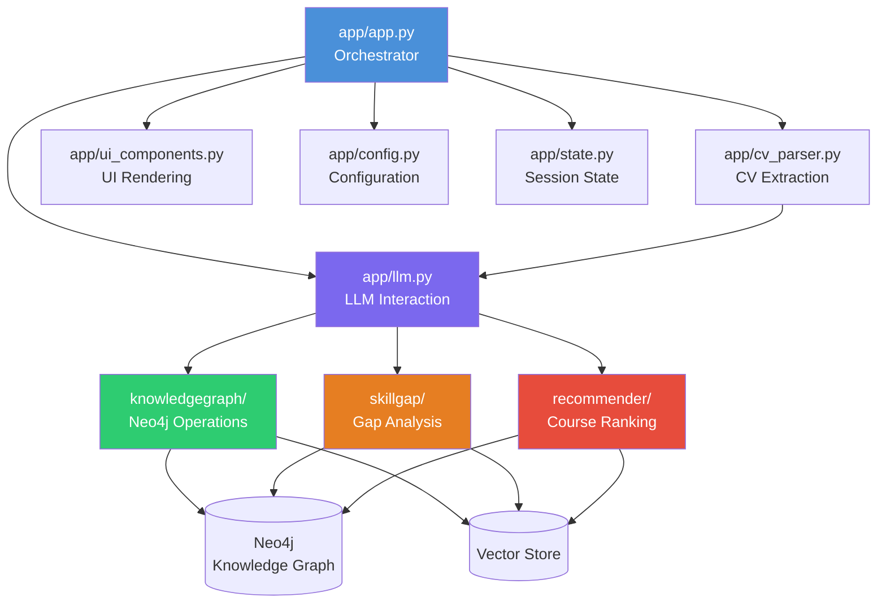

# System Architecture

> Hybrid Intelligent Reasoning Architecture — where symbolic methods ensure correctness, statistical and neural models handle ambiguity, knowledge representations provide semantic grounding, and explanations ensure transparency.

---

## High-Level Overview

SkillUP is structured as a **two-layer** system with a clear separation between data preparation and inference:

1. **Data Ingestion & Representation Layer** — Offline/batch processing of external data sources into structured, queryable formats
2. **Inference & Recommendation Pipeline** — Real-time, user-facing pipeline that reasons over the prepared data

These layers are bridged by two shared stores:
- **Knowledge Graph (Neo4j)** — Structured skill/role/course relationships
- **Vector Store + Ratings Data** — Embedding-based similarity search and course quality signals

---

## Layer 1: Data Ingestion & Representation

```
┌─────────────────────────────────────────────────────────────┐
│                    DATA SOURCES                              │
│                                                              │
│  ┌─────────────┐  ┌─────────────┐  ┌──────────────────────┐│
│  │ Job Descs   │  │ Course      │  │ Peer CVs             ││
│  │ (MCF Portal)│  │ Catalogue   │  │ (Sample Profiles)    ││
│  │             │  │ (SSG /      │  │                      ││
│  │             │  │ SkillsFuture│  │                      ││
│  └──────┬──────┘  └──────┬──────┘  └──────────┬───────────┘│
│         │                │                     │            │
│  ┌──────┴────────────────┴─────────────────────┴──────────┐ │
│  │               NLP Processing Pipeline                   │ │
│  │                                                         │ │
│  │  Scraping → NER → Skill Extraction → Embeddings        │ │
│  │                      ↓                                  │ │
│  │              Graph Construction                         │ │
│  └─────────────────────┬───────────────────────────────────┘ │
│                        │                                     │
│         ┌──────────────┼──────────────────┐                 │
│         ▼                                 ▼                 │
│  ┌──────────────┐              ┌──────────────────┐         │
│  │ Knowledge    │              │ Vector Store +    │         │
│  │ Graph (Neo4j)│              │ Ratings Data      │         │
│  └──────────────┘              └──────────────────┘         │
└─────────────────────────────────────────────────────────────┘
```

### Data Sources

| Source | Description | Key Data |
|--------|-------------|----------|
| **MyCareersFuture (MCF) API** | Government job portal | Job descriptions + tagged skills |
| **SkillsFuture Course Catalogue** | SSG-registered courses | Fees, duration, modality, subsidies |
| **Public CV Databases** | Sample professional profiles | Peer skill benchmarks |
| **Course Ratings + Reviews** | Learner feedback | Quality signals, satisfaction scores |

### NLP Processing Pipeline

The ingestion pipeline performs the following transformations:

1. **Web Scraping** — Scrapy / BeautifulSoup extract raw text from data sources
2. **Named Entity Recognition (NER)** — spaCy identifies skills, roles, organisations
3. **Skill Extraction** — Rule-based + ML extraction of canonical skill entities
4. **Embedding Generation** — Sentence-BERT encodes skills/roles into vector space
5. **Knowledge Graph Construction** — Neo4j graph built from extracted relationships

---

## Layer 2: Inference & Recommendation Pipeline

```
┌─────────────────────────────────────────────────────────────┐
│                    USER INPUTS                               │
│  Uploaded CV · Onboarding Chat · Role, Budget, Time          │
└──────────────────────────┬──────────────────────────────────┘
                           │
┌──────────────────────────▼──────────────────────────────────┐
│              RAG + LLM ORCHESTRATION LAYER                   │
│         LLM retrieves from each reasoning stage              │
│                                                              │
│  ┌────────────────────────────────────────────────────────┐  │
│  │  Stage 1: User Profile Model                           │  │
│  │  CV parsing → skill extraction → skill vectors         │  │
│  │  + constraint vectors (budget, time, modality)         │  │
│  │                                                        │  │
│  │  Techniques: Knowledge Representation,                 │  │
│  │              Rule-Based Reasoning,                     │  │
│  │              Semantic Similarity                       │  │
│  └───────────────────────┬────────────────────────────────┘  │
│                          ↓                                   │
│  ┌────────────────────────────────────────────────────────┐  │
│  │  Stage 2: Skill Gap Model                              │  │
│  │  KG traversal + competing experts                      │  │
│  │  (JD demand vs peer CV analysis)                       │  │
│  │                                                        │  │
│  │  Techniques: Graph-Based Reasoning,                    │  │
│  │              Inference Under Uncertainty,              │  │
│  │              Multi-Expert Arbitration                  │  │
│  └───────────────────────┬────────────────────────────────┘  │
│                          ↓                                   │
│  ┌────────────────────────────────────────────────────────┐  │
│  │  Stage 3: Course Recommendation Model                  │  │
│  │  CSP filtering · Fuzzy logic · Neural ranker · CBR     │  │
│  │                                                        │  │
│  │  Techniques: Constraint Satisfaction,                  │  │
│  │              Case-Based Reasoning,                     │  │
│  │              Fuzzy Logic, Score Fusion                  │  │
│  └───────────────────────┬────────────────────────────────┘  │
│                          ↓                                   │
│  ┌────────────────────────────────────────────────────────┐  │
│  │  RAG Explanation Engine                                │  │
│  │  LLM generates grounded explanations by tracing        │  │
│  │  reasoning through all three stages                    │  │
│  └───────────────────────┬────────────────────────────────┘  │
│                          ↓                                   │
│         ✅ Personalised Learning Path + Explanations         │
└─────────────────────────────────────────────────────────────┘
```

### RAG + LLM Orchestration

The orchestration layer sits above all three reasoning stages. For each user query:

1. The **LLM** coordinates the pipeline, calling each stage in sequence
2. Each stage **retrieves** relevant data from the KG and vector store
3. The LLM **generates** grounded explanations by tracing through the reasoning chain
4. All outputs converge into a **unified, explainable recommendation**

---

## Cross-Cutting Concerns

### Transparency & Trust

- **No hallucinated facts** — all explanations grounded in retrieved records
- Explanations trace: skill gaps from KG traversal → expert arbitration outcomes → CSP constraint satisfaction → confidence signals

### Adaptive Feedback Loop

```
User completes a course
        ↓
Skill vector updated
        ↓
Gap Model reruns automatically
        ↓
Recommendation trimmed or extended dynamically
        ↓
SkillUP evolves from one-off recommender → live career coach
```

The system reasons **continuously** as the user progresses through their learning journey.

---

## Module Dependency Map



---

## Related Documentation

- [Data Pipeline](data_pipeline.md) — Detailed ingestion and preprocessing
- [Stage 1: User Profile Model](stage1_user_profile.md) — CV parsing and skill extraction
- [Stage 2: Skill Gap Model](stage2_skill_gap.md) — Gap analysis and expert arbitration
- [Stage 3: Course Recommendation](stage3_course_recommendation.md) — Constraint-aware ranking
- [RAG Explanation Engine](rag_explanation_engine.md) — Transparency and grounded explanations
- [Evaluation](evaluation.md) — Metrics, benchmarks, and IRS course mapping
- [Tech Stack](tech_stack.md) — Full technology reference
